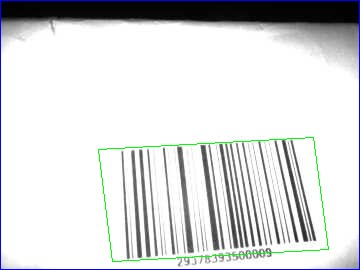
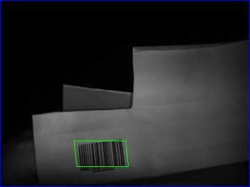
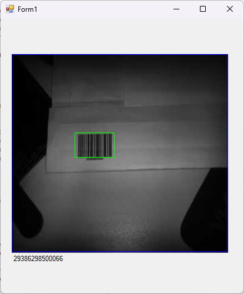

# Cognex Barcode Reader SerialPort Communication

Bu proje, **Cognex DM280X** barkod okuyucu ile **serial port** üzerinden haberleşmeyi sağlayan örnek bir uygulamadır.

## Özellikler

- Barkod okuma
- Görüntü ekrana yansıtma

## Gereksinimler

- .NET Framework 4.7.2 veya daha yüksek
- Visual Studio 2019 veya daha yeni bir sürüm
- Seri port bağlantısı için uygun kablo

## Kurulum

Kullanım
Uygulamayı başlatın.
Seri port üzerinden otomatik bağlanın.
Barkod okutun ve verileri görüntüleyin.

## Görsel

