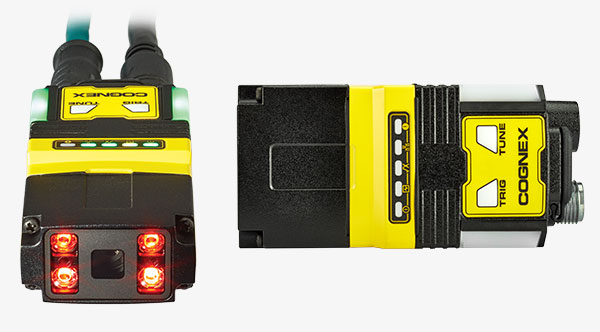
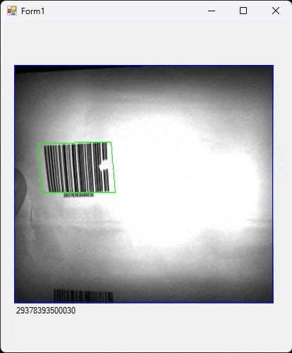

# CognexBarcodeReader

**Cognex DM280X barkod okuyucu ile Type-C kablosu üzerinden seri port iletiimi sağlayan örnek uygulama.**

#Özellikler

- Barkod okuma
- Okunan barkod verilerini ekran görüntüsü ile birlikte gösterme

# Görsel



# Kurulum

```bash
# Repo'yu klonla
git clone https://github.com/alknbugra/CognexBarcodeReader.git

# Dizine gir
cd CognexBarcodeReader

# Gerekli bağımlılıkları yükle
- (C# projesi olduğundan, örnek Visual Studio ortamında açılabilir veya dotnet CLI ile)
- dotnet restore veya Visual Studio ile sln dosyasını aç

# Uygulamayı çalıştır
- Visual Studio üzerinden F5 ile ya da dotnet run komutu (varsa) ile çalıştır

# Kullanım
- Uygulama ekranında okunan barkod verileri ekranda görüntülenir
- (Kod snippet'inle ilgili örnek ekleyebilirsin)


